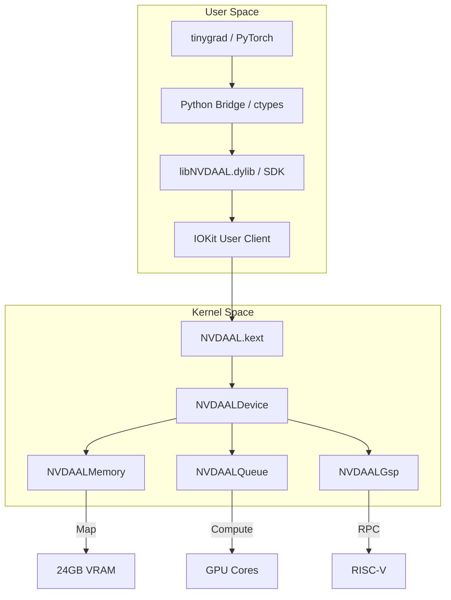
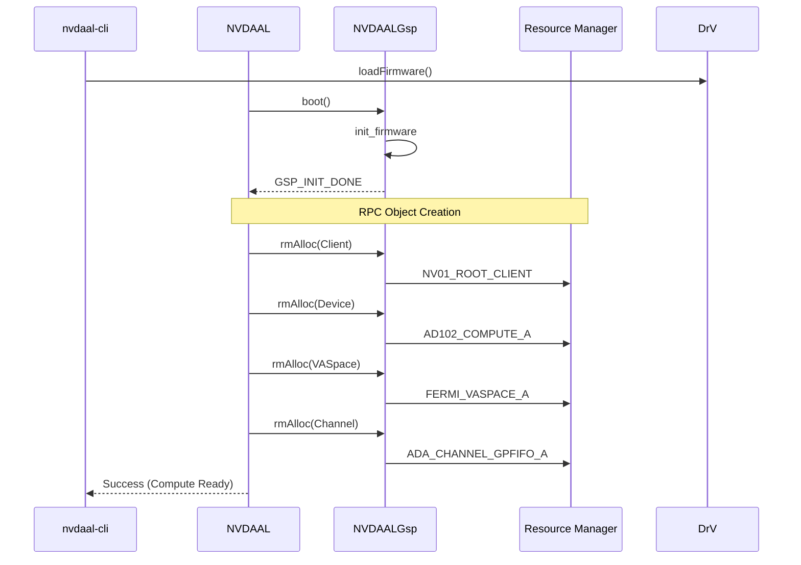

# NVDAAL Architecture - Compute Driver

## Overview

Compute-only driver for RTX 4090. **No display support**.



## Kext Components

### NVDAALDevice (IOService)
Main component. Manages lifecycle.

```cpp
class NVDAAL : public IOService {
    // PCI and MMIO
    IOPCIDevice *pciDevice;
    IOMemoryMap *bar0Map;      // MMIO registers
    IOMemoryMap *bar1Map;      // VRAM aperture

    // GSP RM Handles
    uint32_t hClient;
    uint32_t hDevice;

    // Sub-components
    NVDAALGsp *gsp;            // GSP controller & RPC
    NVDAALMemory *memory;      // Memory manager
    NVDAALVASpace *vaSpace;    // Virtual Memory (MMU)
    NVDAALChannel *channel;    // Compute Queue (GPFIFO)
};
```

### Initialization Sequence (Compute)



### NVDAALGsp
Manages communication with the GSP (GPU System Processor).
Implements `rmAlloc`, `rmControl`, `rmFree` for object management.

```cpp
class NVDAALGsp {
    // ... firmware management ...

    // Resource Manager
    bool rmAlloc(uint32_t hClient, uint32_t hParent, uint32_t hObject, 
                 uint32_t hClass, void *params, size_t paramsSize);
};
```

### NVDAALVASpace (MMU)
Manages Virtual Address Space using `FERMI_VASPACE_A`.
- Allocates Page Directory (PDE) in VRAM.
- Registers VASpace with GSP.
- Maps BAR1 and System Memory into GPU VA.

### NVDAALChannel (GPFIFO)
Manages Compute Queue using `ADA_CHANNEL_GPFIFO_A`.
- Allocates Ring Buffer (GPFIFO) in System Memory.
- Allocates User Doorbell (UserD).
- Submits work via `submit(gpuAddr, len)`.


## Important Registers (Compute)

### GSP Registers (0x110000)
```
NV_PGSP_FALCON_MAILBOX0    0x110040  // RPC command
NV_PGSP_FALCON_MAILBOX1    0x110044  // RPC status
NV_PGSP_QUEUE_HEAD(i)      0x110C00  // Queue heads
NV_PGSP_QUEUE_TAIL(i)      0x110C80  // Queue tails
```

### RISC-V (GSP Core)
```
NV_PRISCV_RISCV_CPUCTL     0x110388  // CPU control
NV_PRISCV_RISCV_BR_RETCODE 0x110400  // Boot return code
```

### Memory Controller
```
NV_PFB_PRI_MMU_CTRL        0x100C80  // MMU control
NV_PFB_PRI_MMU_WPR2_ADDR   0x1FA824  // WPR2 address
```

### Compute Engine (CE)
```
NV_PCE_FALCON_MAILBOX0     0x104040  // CE mailbox
NV_PCE_INTR_EN             0x104100  // Interrupts
```

## Initialization Sequence (Compute)

```
1. PCI Probe
   └─ Verify Device ID (0x10DE:0x2684)

2. Map BARs
   ├─ BAR0: MMIO registers
   └─ BAR1: VRAM aperture (24GB)

3. Early Init
   ├─ Read NV_PMC_BOOT_0 (chip ID)
   ├─ Check WPR2 status
   └─ Reset if needed

4. Load Firmware
   ├─ VBIOS (FWSEC ucode)
   ├─ Bootloader (kgspBinArchiveBooterLoadUcode)
   └─ GSP firmware (gsp-570.144.bin)

5. Initialize GSP
   ├─ Allocate DMA queues
   ├─ Configure WPR metadata
   ├─ Execute bootloader
   └─ Wait for GSP_INIT_DONE

6. Configure Compute
   ├─ Allocate compute queue
   ├─ Configure memory manager
   └─ Register service

7. Ready for Compute!
```

## RPC Protocol

Communication with GSP uses RPC messages:

```cpp
struct RpcMessage {
    uint32_t signature;    // 0x43505256 ("VGPU")
    uint32_t version;      // 3 << 24
    uint32_t result;
    uint32_t function;
    uint32_t length;
    uint8_t  payload[];
};

// Important functions for compute:
#define NV_VGPU_MSG_FUNCTION_GSP_SET_SYSTEM_INFO  0x15
#define NV_VGPU_MSG_FUNCTION_SET_REGISTRY         0x16
#define NV_VGPU_MSG_FUNCTION_GSP_RM_ALLOC         0x24
#define NV_VGPU_MSG_FUNCTION_GSP_RM_CONTROL       0x25
```

## Memory Layout

```
+------------------+ 0x0
|   MMIO (BAR0)    | 16MB - Registers
+------------------+ 0x1000000
|                  |
|   VRAM (BAR1)    | 24GB - GPU Memory
|                  |
+------------------+ 0x600000000
|   GSP Heap       | 129MB
+------------------+
|   WPR2 Region    | Write Protected
+------------------+
|   Framebuffer    | (not used - compute only)
+------------------+
```

## macOS vs Linux Differences

| Aspect | Linux | macOS |
|--------|-------|-------|
| DMA Memory | dma_alloc_coherent | IOBufferMemoryDescriptor |
| MMIO Map | ioremap | mapDeviceMemoryWithIndex |
| Interrupts | request_irq | registerInterrupt |
| User Access | /dev/nvidiaX | IOUserClient |
