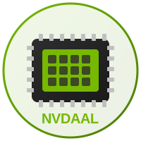

<h1 align="center">
  <br>
  
  <br>
  NVDAAL - NVIDIA Ada Lovelace Compute Driver
  <br>
</h1>

<p align="center">
  <strong>Open-source compute driver for RTX 40 series GPUs on macOS - Pure AI/ML power</strong>
</p>

<p align="center">
  
  
  
  
  
  <a href="https://github.com/gabrielmaialva33/NVDAAL-Driver/commits/master">
    
  </a>
  
</p>

<br>

<p align="center">
  <a href="#bookmark-about">About</a>&nbsp;&nbsp;&nbsp;|&nbsp;&nbsp;&nbsp;
  <a href="#rocket-quick-start">Quick Start</a>&nbsp;&nbsp;&nbsp;|&nbsp;&nbsp;&nbsp;
  <a href="#wrench-features">Features</a>&nbsp;&nbsp;&nbsp;|&nbsp;&nbsp;&nbsp;
  <a href="#gear-architecture">Architecture</a>&nbsp;&nbsp;&nbsp;|&nbsp;&nbsp;&nbsp;
  <a href="#memo-roadmap">Roadmap</a>&nbsp;&nbsp;&nbsp;|&nbsp;&nbsp;&nbsp;
  <a href="#handshake-contributing">Contributing</a>&nbsp;&nbsp;&nbsp;|&nbsp;&nbsp;&nbsp;
  <a href="#scroll-license">License</a>
</p>

<br>

## :bookmark: About

**NVDAAL** (NVIDIA Ada Lovelace) is an open-source **compute-only** driver for NVIDIA RTX 40 series GPUs on macOS Hackintosh. This driver focuses exclusively on **AI/ML workloads**, leveraging the full compute power of Ada Lovelace architecture without display overhead.

### :warning: Important Notice

This project is **experimental** and in early development. It requires:
- Deep understanding of GPU architecture
- Hackintosh environment with proper configuration
- GSP (GPU System Processor) firmware for full functionality

### :zap: Why Compute-Only?

| Aspect | Benefit |
|--------|---------|
| **Simplicity** | No framebuffer, display engine, or video output code |
| **Focus** | 100% of GPU power dedicated to compute workloads |
| **Viability** | Based on proven TinyGPU implementation |
| **Performance** | Direct access to CUDA cores and Tensor cores |

## :desktop_computer: Supported Hardware

| GPU | Device ID | CUDA Cores | Tensor Cores | Status |
|-----|-----------|------------|--------------|--------|
| RTX 4090 | `0x2684` | 16,384 | 512 | :construction: Development |
| RTX 4090 D | `0x2685` | 14,592 | 456 | :hourglass: Planned |
| RTX 4080 Super | `0x2702` | 10,240 | 320 | :hourglass: Planned |
| RTX 4080 | `0x2704` | 9,728 | 304 | :hourglass: Planned |
| RTX 4070 Ti Super | `0x2705` | 8,448 | 264 | :hourglass: Planned |
| RTX 4070 Ti | `0x2782` | 7,680 | 240 | :hourglass: Planned |
| RTX 4070 Super | `0x2860` | 7,168 | 224 | :hourglass: Planned |
| RTX 4070 | `0x2786` | 5,888 | 184 | :hourglass: Planned |

## :rocket: Quick Start

### :heavy_check_mark: Prerequisites

- macOS Tahoe 26+ (via OpenCore 1.0.7+)
- Xcode Command Line Tools
- NVIDIA RTX 40 series GPU
- Boot args: `kext-dev-mode=1` or `amfi_get_out_of_my_way=0x1`

### :arrow_down: Installation

```bash
# Clone the repository
git clone https://github.com/gabrielmaialva33/NVDAAL-Driver.git
cd NVDAAL-Driver

# Build the kext
make clean && make

# Validate structure
make test

# Load temporarily (for testing)
make load

# Check logs
make logs
```

### :package: Permanent Installation

```bash
# Install to /Library/Extensions
make install

# Reboot required
sudo reboot
```

## :wrench: Features

### Current (v0.1.0)
- :white_check_mark: PCI device detection and enumeration
- :white_check_mark: BAR0/BAR1 memory mapping (MMIO + VRAM)
- :white_check_mark: Chip identification (architecture, implementation)
- :white_check_mark: GSP/RISC-V status monitoring
- :white_check_mark: Support for multiple RTX 40 series GPUs

### In Development
- :construction: GSP firmware loading and initialization
- :construction: RPC communication with GSP
- :construction: DMA buffer allocation

### Planned
- :hourglass: Compute queue management
- :hourglass: Memory allocation API
- :hourglass: User-space library (libNVDAAL)
- :hourglass: tinygrad/PyTorch integration

## :gear: Architecture

```
┌──────────────────────────────────────────────────────────────┐
│                      User Space                               │
│  ┌─────────────────────┐  ┌───────────────────────────────┐  │
│  │  tinygrad / PyTorch │  │      libNVDAAL.dylib          │  │
│  │   (ML Frameworks)   │  │   (User-space Interface)      │  │
│  └──────────┬──────────┘  └───────────────┬───────────────┘  │
│             │                              │                  │
│             └──────────────┬───────────────┘                  │
│                            │                                  │
│                 ┌──────────▼──────────┐                       │
│                 │   IOKit UserClient  │                       │
│                 └──────────┬──────────┘                       │
└────────────────────────────┼──────────────────────────────────┘
                             │
┌────────────────────────────▼──────────────────────────────────┐
│                     Kernel Space                              │
│                                                               │
│  ┌─────────────────────────────────────────────────────────┐  │
│  │                     NVDAAL.kext                         │  │
│  │                                                         │  │
│  │  ┌────────────────┐  ┌────────────────┐  ┌───────────┐  │  │
│  │  │  NVDAALDevice  │  │  NVDAALMemory  │  │ NVDAALQueue│  │  │
│  │  │  - PCI init    │  │  - VRAM alloc  │  │ - Commands │  │  │
│  │  │  - MMIO map    │  │  - DMA buffers │  │ - Submit   │  │  │
│  │  │  - GSP init    │  │  - Page tables │  │ - Sync     │  │  │
│  │  └───────┬────────┘  └───────┬────────┘  └─────┬─────┘  │  │
│  │          │                   │                 │        │  │
│  │          └─────────┬─────────┴─────────────────┘        │  │
│  │                    │                                    │  │
│  │          ┌─────────▼─────────┐                          │  │
│  │          │     NVDAALGsp     │                          │  │
│  │          │  - RPC messages   │                          │  │
│  │          │  - Firmware load  │                          │  │
│  │          │  - Event handling │                          │  │
│  │          └─────────┬─────────┘                          │  │
│  └────────────────────┼────────────────────────────────────┘  │
└───────────────────────┼───────────────────────────────────────┘
                        │
┌───────────────────────▼───────────────────────────────────────┐
│                     Hardware                                   │
│                                                                │
│  ┌──────────────────────────────────────────────────────────┐  │
│  │                  RTX 4090 (AD102)                        │  │
│  │                                                          │  │
│  │  ┌─────────────┐  ┌─────────────┐  ┌──────────────────┐  │  │
│  │  │ GSP (RISCV) │  │   GPC x12   │  │ Memory Controller│  │  │
│  │  │ - Firmware  │  │  - SM x128  │  │  - 24GB GDDR6X   │  │  │
│  │  │ - RPC       │  │  - Tensors  │  │  - 384-bit bus   │  │  │
│  │  └─────────────┘  └─────────────┘  └──────────────────┘  │  │
│  │                                                          │  │
│  └──────────────────────────────────────────────────────────┘  │
└────────────────────────────────────────────────────────────────┘
```

## :memo: Roadmap

| Phase | Description | Status |
|-------|-------------|--------|
| **1. Foundation** | PCI detection, BAR mapping, chip ID | :white_check_mark: Complete |
| **2. GSP Init** | Firmware loading, RPC setup, boot sequence | :construction: In Progress |
| **3. Memory** | VRAM allocation, DMA buffers, page tables | :hourglass: Planned |
| **4. Compute** | Queue management, command submission | :hourglass: Planned |
| **5. User API** | libNVDAAL, IOUserClient interface | :hourglass: Planned |
| **6. Integration** | tinygrad, PyTorch backends | :hourglass: Planned |

## :open_file_folder: Project Structure

```
NVDAAL-Driver/
├── .github/                  # GitHub templates and assets
│   ├── assets/              # Logo and images
│   └── ISSUE_TEMPLATE/      # Issue templates
├── Docs/                     # Technical documentation
│   ├── ARCHITECTURE.md      # Detailed architecture
│   ├── GSP_INIT.md          # GSP initialization guide
│   └── TODO.md              # Development checklist
├── Firmware/                 # Firmware files (user-provided)
│   └── README.md            # Firmware instructions
├── Sources/                  # Source code
│   ├── NVDAAL.cpp           # Main driver (IOService)
│   ├── NVDAALGsp.cpp        # GSP controller
│   ├── NVDAALGsp.h          # GSP headers
│   └── NVDAALRegs.h         # Register definitions
├── Tools/                    # Utility scripts
│   └── extract_vbios.py     # VBIOS extraction tool
├── Info.plist               # Kext configuration
├── LICENSE                  # MIT License
├── Makefile                 # Build system
└── README.md                # This file
```

## :handshake: Contributing

Contributions are welcome! Please read our [Contributing Guide](CONTRIBUTING.md) before submitting a PR.

### Development Commands

```bash
make clean        # Clean build artifacts
make              # Build the kext
make test         # Validate kext structure
make load         # Load kext temporarily
make unload       # Unload kext
make logs         # View driver logs
make logs-live    # Stream logs in real-time
make status       # Check kext status
```

## :books: Resources

- [TinyGPU/tinygrad](https://github.com/tinygrad/tinygrad) - Primary reference for GSP
- [NVIDIA open-gpu-kernel-modules](https://github.com/NVIDIA/open-gpu-kernel-modules) - Official open-source drivers
- [Nouveau Project](https://nouveau.freedesktop.org/) - Linux open-source NVIDIA driver
- [envytools](https://github.com/envytools/envytools) - NVIDIA GPU documentation

## :warning: Disclaimer

This project is for **educational and research purposes only**. There is no guarantee of functionality. Use of proprietary firmware may violate NVIDIA's license terms. Use at your own risk.

## :scroll: License

This project is licensed under the MIT License - see the [LICENSE](LICENSE) file for details.

---

<p align="center">
  Made with :purple_heart: by <a href="https://github.com/gabrielmaialva33">Gabriel Maia</a>
</p>
